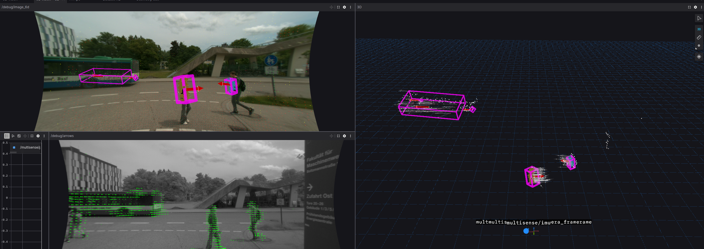

# Stereo Perception System for Automated Vehicles (README WIP)

This repository contains the full implementation of a stereo-camera-based
perception and criticality assessment system developed as part of a Master’s
thesis at the Chair of Automotive Technology (FTM), TUM. The system is
designed for real-time deployment on the autonomous research vehicle EDGAR,
enabling deterministic environment perception during teleoperation scenarios.





## Project Overview

The system is structured into two main pipelines:

- **Perception Pipeline**: Estimates 3D motion of surrounding objects using stereo
  vision, optical flow, and Kalman filtering.
- **Criticality Pipeline**: Computes risk metrics such as Time-To-Collision (TTC)
  based on object motion and ego vehicle trajectory.

Both pipelines are implemented in **C++** and **ROS 2**, and are fully containerized
via **Docker**. The project includes Dockerfiles, configuration scripts, and
Docker Compose files for simplified deployment.

## Folder Structure

```text
stereo_perception/
├── src/
│   ├── perception_pipeline/           # Depth, flow, Kalman filter, object detection
│   ├── criticallity_pipeline/         # Time-To-Collision (TTC) computation
│   ├── launch_packages/               # ROS 2 launch files for both pipelines
│   └── utils/                         # Bridges, custom messages, conversion tools
│
├── docker/
│   ├── perception_pipeline/           # Dockerfile, config and launch scripts
│   ├── criticallity_pipeline/
│   ├── criticallity_pipeline_autoware/
│   ├── stereo_perception_edgar_bridge/
│   ├── docker-compose-edgar.yml       # Launches full system on EDGAR
│   ├── docker-compose-test.yml        # Launches system for local/test runs
│   └── docker-compose-criticallity-autoware-*.yml # Launches criticallity pipeline with autoware
│
├── rviz_layout.rviz                   # RViz layout configuration
├── foxglove_layout.json               # Foxglove Studio layout configuration
├── Makefile                           # Build and utility commands
├── .env                               # Docker environment variables
└── Doxyfile                           # Doxygen config for documentation
```

## Building and Running

### Build Docker Images

Each pipeline has a `scripts/` folder with `docker_build.sh` and `docker_run.sh`.

To build a specific image (e.g., perception):

    cd docker/perception_pipeline/scripts
    ./docker_build.sh

To run the corresponding container:

    ./docker_run.sh

### Full System Launch on EDGAR

Use the provided Docker Compose configuration:

    docker compose -f docker/docker-compose-edgar.yml up

### Local or Test Launch

For local testing:

    docker compose -f docker/docker-compose-test.yml up

## Building from Source (Optional)

If developing outside containers, or if you want to build from source inside a running container:

1. **Clean the workspace**

   ```bash
   make clean
   ```

1. **Build perception pipeline**

   ```bash
   make sp-perception-pipeline
   ```

1. **Build criticallity pipeline**

   ```bash
   make sp-criticallity-pipeline
   ```


## Building from Source (Optional)

If developing outside containers, or want to build from source inside container:

1. To clean workspace
  `make clean`

2. Build perception pipeline
   `make sp-perception-pipeline`

3. Build criticallity pipeline
   `make sp-criticallity-pipeline`


## Visualization

- RViz2: Load `rviz_layout.rviz`
- Foxglove Studio: Load `foxglove_layout.json`

## Documentation

To generate C++ documentation:

    ```bash
    doxygen Doxyfile
    

## Thesis Context

This repository is part of the thesis:

**Stereokamera-basierte Umfeldwahrnehmung für automatisierte Fahrzeuge**  
Technische Universität München Chair of Automotive Technology (FTM)  
Supervisor: David Brecht, M.Sc., Prof. Dr.-Ing. Markus Lienkamp 
Duration: 01.12.2024 – 01.06.2025  
